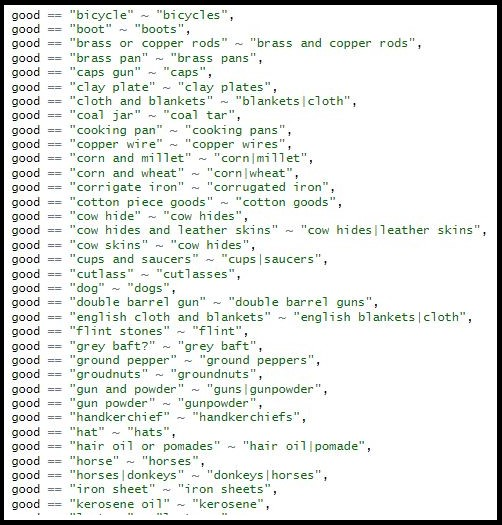

The dataset available for download contains a total of 7,735 records and follows the organization of the source materials. Each record contains information about a commodity that moved across the Volta River between 1901 and 1940. The records include quantities for monthly, quarterly, and yearly periods, which reflect the information in the original sources. Where available, the record includes a description of the commodity, as well as the location and  direction of movement. In working with the archival documents, I found that the monthly records contained more detailed information than the records from longer time periods. This is the result of the reporting hierarchy, whereby colonial officials aggregated the monthly information into quarterly and yearly reports without the detailed descriptions of the commodities contained in the monthly documents. For this reason, I sought to include as many monthly records as possible.

Download Version 0.1 of the Volta River Commodities Data:
- [CSV](../assets/data/data-0-1.csv)
- [JSON](../assets/data/data-0-1.json)
- [R Project](../assets/data/r-project-0-1.zip)

This Volta River Commodities Data is made available under the Open Data Commons Attribution License: [https://opendatacommons.org/licenses/by/1.0/](https://opendatacommons.org/licenses/by/1.0/).

The creation of the digital dataset began with translating information on paper documents into digital tables. In total, I created seven tables organized by area covered and time period. Colonial officials collected the commodity information for different geographies, including preventative stations, districts, provinces, and regions. The different time periods are mentioned above. For me, this made the data entry process faster, since each geographic area and time period has different fields associated with it.

In entering the information into the tables, I maintained the organization of the source documents by reproducing the columns for each of the records. Then, row by row, I entered the details of each record as close to word for word as possible. In some cases, the handwriting was illegible or the document was partially destroyed, whether by insects or by the ravages of time.

When I left the archives, I had eight CSV files with commodity information for different geographic areas and time periods. To transform these different files into one final dataset, I used [R](https://www.r-project.org/), a computer language for statistical analysis. I first combined the different files into one table by aligning the fields and binding the tables to one another. I then edited the information in each field by standardizing the spelling. In some cases, this standardization process was easy, where the units of measurement contained plural and singular forms. In other cases, I consulted historical texts to confirm place names, measurements, and commodity names.

<figure class="align-center">
  
  <figcaption>A Sample of the R Code.</figcaption>
</figure>

The more complicated part of the transformation process entailed organizing the commodity descriptions into a system that would facilitate the analysis of the final dataset. To this end, I created three separate fields with the first the name of the commodity, the second its origin, and the third its description. The name of the commodity is a simplified name without any additional attributes, like color or material. The origin field contains information about who made the commodity, which colonial officials divided between Africans and Europeans, with European designations further specified by country of origin. The final field contains any additional information about the commodity in the original source.

All of the transformations I performed on the digital tables are replicable using R and available for download via an R Project folder. This folder contains the seven original tables as CSV files and an R file with the commands used to standardize the data and to transform it into CSV and JSON files. Specific details about the decisions I made can be found in the R file.
