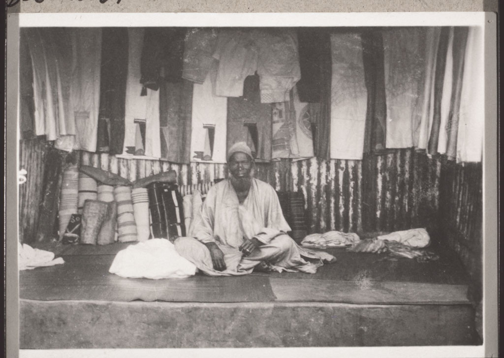

In West African history, rivers feature as important conduits of trade and transportation. River traffic carried important commodities like gold and salt along the Niger, Senegal, and Volta Rivers. The trade in gold, in particular, facilitated the development of centralized West African states.

 <!--http://exploringafrica.matrix.msu.edu/curriculum/unit-four/module-seventeen-activity-two/-->

Although the Volta River does not stretch across the region as far as the Niger River does, it remains an important nexus of trade in West Africa. One of the most important commodities traded along the Volta River is salt. From at least the sixteenth to the twentieth century, traders moved salt produced in lagoons along the coast up the river in canoes.

In the nineteenth century, trade along the Volta River increased due to the intraregional trade between the Asante Empire and the Sokoto Caliphate. After the establishment of the Sokoto Caliphate in 1804, the caravan trade increased significantly, radiating outward from the Caliphate to major trading hubs across the region. One of these trading hubs, Salaga, formed on the bank of the Volta River, where the caravans met traders from the Asante Empire. At Salaga, kola nuts from the forests of the Asante Empire flowed out, while textiles, leather, livestock, jewelry, and natron flowed in.

With the onset of colonial rule by the turn of the twentieth century, the British claimed the Volta River, and the Germans the territory to its east. Conflicts between the two European empires affected trade along the Volta River, where district commissioners and preventative station officers sought to control the flow of goods. Nonetheless, the river-born and caravan trade continued, with new trade routes designed by traders to bypass the colonial controls.

 <!--http://www.bmarchives.org/items/show/57785-->

<figure class="align-center">
  
  <figcaption>Hausa Trader in the Gold Coast, 1925: <a href="http://www.bmarchives.org/items/show/57785">BMArchives</a>.</figcaption>
</figure>

The Germans lost control of Togoland after World War I, and the British began administering the territory to the east of the Volta River. Beginning in the 1930s, cars and trucks replaced some of the canoe traffic on the Volta River, carrying salt and other commodities from the coast to towns in the Gold Coast. The roads, though, continued to follow the distribution networks along the Volta River.

After Ghana achieved independence on March 6, 1957, the government moved forward with plans to build a dam on the Volta River at Akosombo. Completed in 1965, the Akosombo Dam transformed the landscape along the Volta River, forcing the relocation of communities and trading towns upriver from the dam.
