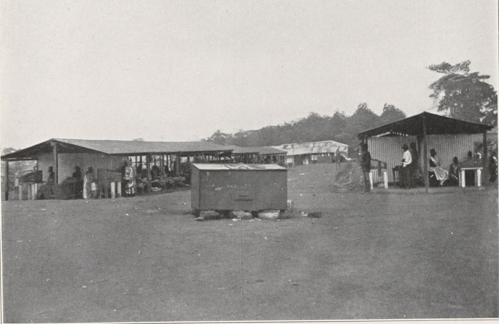
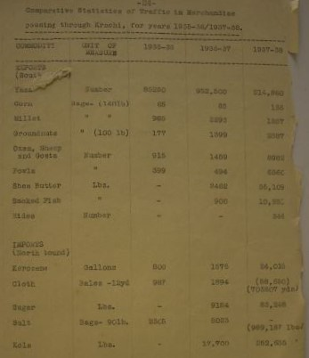

Exports are the best sources for trade statistics during the colonial period in Africa because the ports provide a natural barrier with which to collect information on the commodities leaving and entering the colony. The export trade, though, only captures Africa's trade across the oceans, not the dynamic nature of trade within the continent.

<figure class="align-center">
  
  <figcaption>Zongo Market in the Gold Coast, 1925: <a href="http://www.bmarchives.org/items/show/70290">BMArchives</a>.</figcaption>
</figure>

Interegional trade remained robust during the colonial period and proved difficult for colonial states to control, especially along land borders. In the early colonial period, the Gold Coast government setup preventative stations along the Volta River to control trade between the Gold Coast and Togoland. The first preventative station was established in 1898. The information recorded by officials at preventative stations prove much more erratic than that at the ports, as data collection policies changed more quickly along with the officials stationed there.

<figure style="width: 347px" class="align-center">
  
  <figcaption>Kete-Krachi District Report, 1938: <a href="https://eap.bl.uk/archive-file/EAP541-1-3-57">Endangered Archives Programme</a>.</figcaption>
</figure>

Nonetheless, the records collected at preventative stations comprise an important historical source for commodities that crossed the Volta River. These records are the basis for [the digital dataset available on this website](https://ryattay.github.io/volta-river-commodities/data/). The information was collected from preventative station records at the [Public Records and Archives Administration Department (PRAAD)](https://praad.gov.gh/) in Accra and Tamale, Ghana. The trade records include statistics on the types and amounts of goods carried by traders across the river. The statistics, however, are not a complete picture of trade in the region, as many traders avoided customs stations where the statistics were recorded. Nonetheless, the statistics illustrate trends in the internal trade that reflect wider political, economic, and social changes across the region.
